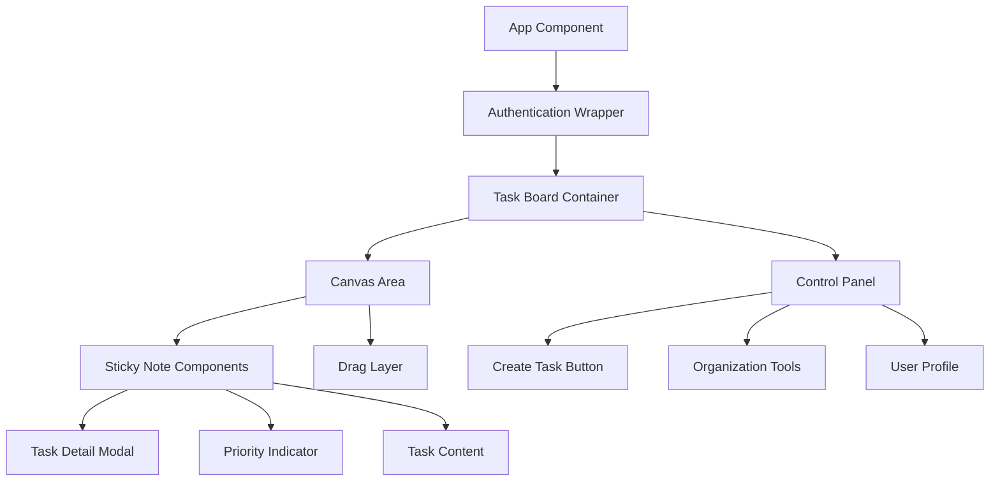
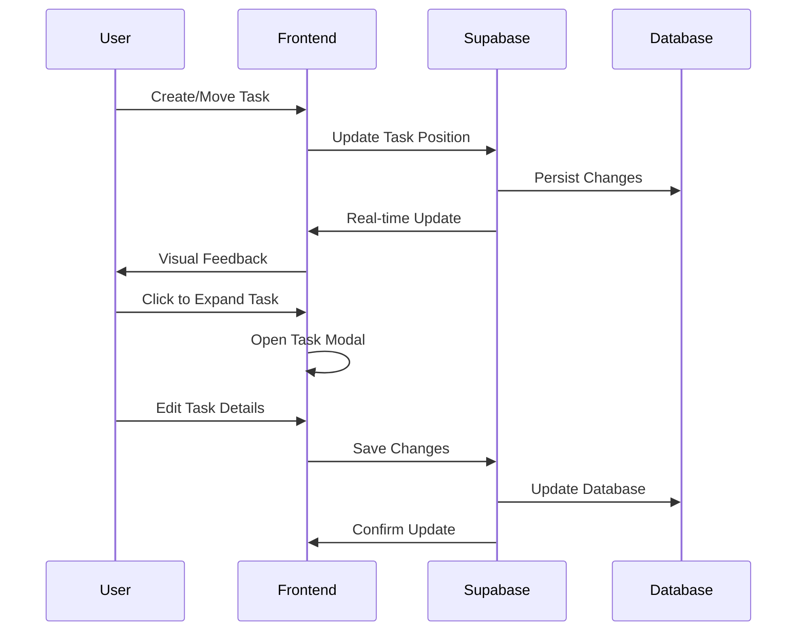
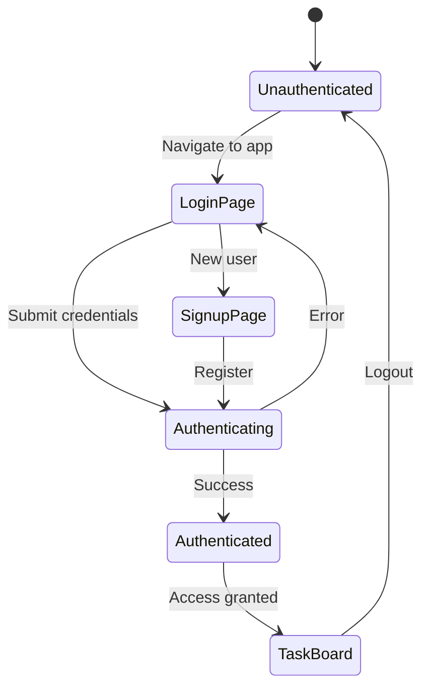

# Task Board Implementation Design

## Overview

The Task Board is a modern, intuitive task management application that mimics the macOS desktop experience. Users can create, organize, and manage tasks using draggable sticky notes on a freeform canvas. The application integrates with Git for version control and Supabase for backend services, authentication, and data persistence.

### Core Features
- **Freeform Canvas**: Tasks represented as sticky notes that can be placed anywhere on the board
- **Drag & Drop Interface**: Seamless repositioning of tasks similar to macOS desktop icons
- **Priority-Based Color Coding**: Green (low), Yellow (medium), Red (high priority)
- **Hidden Control Panel**: macOS-style dock that appears on hover at screen edge
- **Task Expansion**: Click to expand notes for detailed editing and commenting
- **Real-time Synchronization**: Changes persist across sessions via Supabase

## Technology Stack & Dependencies

### Frontend Stack
- **Framework**: React 18 with TypeScript for type safety
- **Styling**: Tailwind CSS for utility-first styling approach
- **Drag & Drop**: React DnD library for smooth drag-and-drop interactions
- **State Management**: Zustand for lightweight state management
- **Animation**: Framer Motion for smooth transitions and macOS-like animations

### Backend & Services
- **Backend-as-a-Service**: Supabase for database, authentication, and real-time subscriptions
- **Database**: PostgreSQL (via Supabase) for task storage and user management
- **Authentication**: Supabase Auth with email/password and social providers
- **Real-time Updates**: Supabase real-time subscriptions for collaborative features

### Development Tools
- **Version Control**: Git integration for code management
- **Build Tool**: Vite for fast development and optimized builds
- **Package Manager**: npm or yarn for dependency management

## Architecture

### Component Architecture

#### Component Definitions

**App Component**
- Root component managing global application state
- Handles routing and top-level error boundaries
- Integrates Supabase client initialization

**Authentication Wrapper**
- Manages user authentication state
- Handles login/logout flows
- Protects authenticated routes

**Task Board Container**
- Main workspace component
- Manages board state and task positions
- Handles real-time synchronization with Supabase

**Canvas Area**
- Freeform workspace for task placement
- Implements drag-and-drop zones
- Manages coordinate system for task positioning

**Sticky Note Components**
- Individual task representation
- Handles drag interactions and visual feedback
- Manages priority color display

**Control Panel**
- Hidden dock-style interface
- Appears on mouse hover at screen edge
- Contains task creation and organization tools

**Task Detail Modal**
- Expanded view for task editing
- Includes description, comments, and metadata
- Provides delete and archive functionality

### Data Flow Architecture

## Data Models & Database Schema

### Tasks Table
| Field | Type | Description | Constraints |
|-------|------|-------------|-------------|
| id | UUID | Primary key | NOT NULL, DEFAULT uuid_generate_v4() |
| user_id | UUID | Owner reference | NOT NULL, FOREIGN KEY |
| title | TEXT | Task title | NOT NULL, LENGTH 1-100 |
| description | TEXT | Detailed description | OPTIONAL |
| priority | ENUM | Priority level | LOW, MEDIUM, HIGH |
| position_x | INTEGER | X coordinate on canvas | NOT NULL, DEFAULT 0 |
| position_y | INTEGER | Y coordinate on canvas | NOT NULL, DEFAULT 0 |
| color | VARCHAR(7) | Hex color code | NOT NULL, DEFAULT based on priority |
| created_at | TIMESTAMP | Creation timestamp | NOT NULL, DEFAULT NOW() |
| updated_at | TIMESTAMP | Last modification | NOT NULL, DEFAULT NOW() |
| is_archived | BOOLEAN | Archive status | NOT NULL, DEFAULT FALSE |

### Comments Table
| Field | Type | Description | Constraints |
|-------|------|-------------|-------------|
| id | UUID | Primary key | NOT NULL, DEFAULT uuid_generate_v4() |
| task_id | UUID | Task reference | NOT NULL, FOREIGN KEY |
| user_id | UUID | Comment author | NOT NULL, FOREIGN KEY |
| content | TEXT | Comment content | NOT NULL, LENGTH 1-500 |
| created_at | TIMESTAMP | Creation timestamp | NOT NULL, DEFAULT NOW() |

### User Profiles Table
| Field | Type | Description | Constraints |
|-------|------|-------------|-------------|
| id | UUID | Primary key | NOT NULL, REFERENCES auth.users |
| email | TEXT | User email | NOT NULL, UNIQUE |
| display_name | TEXT | Display name | OPTIONAL |
| avatar_url | TEXT | Profile picture URL | OPTIONAL |
| created_at | TIMESTAMP | Registration date | NOT NULL, DEFAULT NOW() |

## User Interface Design

### Canvas Interaction Model

**Freeform Placement**
- Tasks can be positioned anywhere within the canvas boundaries
- Coordinate system uses pixel-based positioning
- Grid snap functionality available as optional feature
- Zoom and pan capabilities for large boards

**Drag & Drop Behavior**
- Smooth drag initiation with visual lift effect
- Real-time position updates during drag
- Collision detection to prevent overlapping
- Snap-to-grid option for organized placement

### Priority Color System

| Priority | Color Code | Visual Representation |
|----------|------------|----------------------|
| Low | #10B981 (Green) | Soft green sticky note |
| Medium | #F59E0B (Yellow) | Warm yellow sticky note |
| High | #EF4444 (Red) | Alert red sticky note |

### Control Panel Design

**macOS-Style Dock Interface**
- Hidden by default at bottom edge of screen
- Appears with smooth animation on mouse hover
- Translucent background with blur effect
- Rounded corners and shadow for depth

**Control Elements**
- **Add Task Button**: Plus icon to create new sticky notes
- **Organization Tools**: Grid view, list view toggle
- **Search Function**: Quick task filtering
- **User Profile**: Avatar and account settings
- **Board Settings**: Canvas preferences and export options

## Authentication Flow

### Authentication Methods
- **Email/Password**: Traditional authentication with Supabase Auth
- **Social Login**: Google, GitHub integration options
- **Session Management**: Automatic token refresh and secure storage
- **Password Recovery**: Email-based password reset flow

## Real-time Collaboration Features

### Live Updates
- Task position changes broadcast to all connected users
- New task creation notifications
- Real-time comment additions
- User presence indicators

### Conflict Resolution
- Last-write-wins strategy for task updates
- Optimistic UI updates with rollback capability
- Connection state management for offline scenarios

## State Management Strategy

### Zustand Store Structure

**Tasks Store**
- Task collection with CRUD operations
- Position tracking and update methods
- Priority filtering and sorting functions
- Real-time subscription management

**UI Store**
- Control panel visibility state
- Selected task tracking
- Modal and overlay management
- Canvas view preferences

**Auth Store**
- User authentication state
- Profile information
- Session management
- Permission handling

## API Integration Layer

### Supabase Integration Patterns

**Task Operations**
- CREATE: Insert new task with generated position
- READ: Fetch user's tasks with real-time subscription
- UPDATE: Modify task properties and position
- DELETE: Soft delete with archive functionality

**Real-time Subscriptions**
- Task table changes for live updates
- Comment additions for expanded tasks
- User presence for collaboration features

### Error Handling Strategy
- Network error recovery with retry logic
- Optimistic updates with rollback capability
- User-friendly error messages
- Offline state management

## Testing Strategy

### Unit Testing
- Component rendering and interaction tests
- State management logic validation
- Utility function verification
- Drag and drop behavior testing

### Integration Testing
- Supabase client integration
- Authentication flow testing
- Real-time subscription functionality
- Cross-component communication

### End-to-End Testing
- Complete user workflows
- Multi-user collaboration scenarios
- Responsive design validation
- Performance under load

### Testing Tools
- **Jest**: Unit and integration testing framework
- **React Testing Library**: Component testing utilities
- **Cypress**: End-to-end testing automation
- **MSW**: API mocking for isolated testing